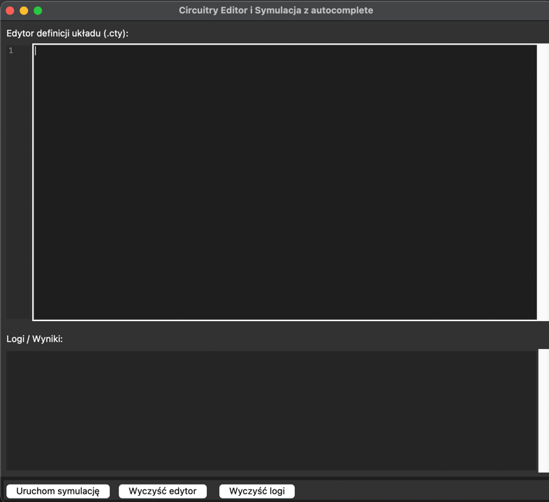
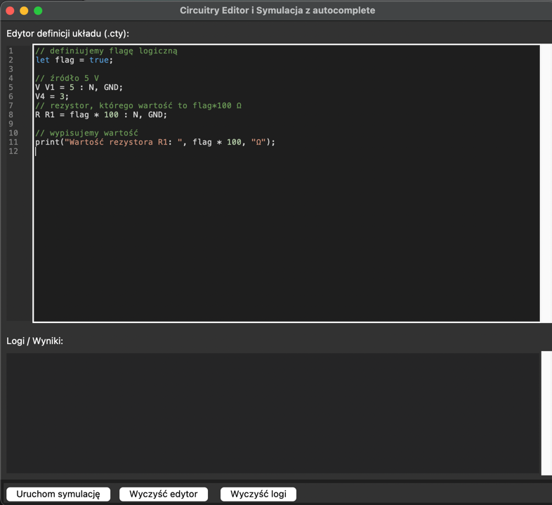
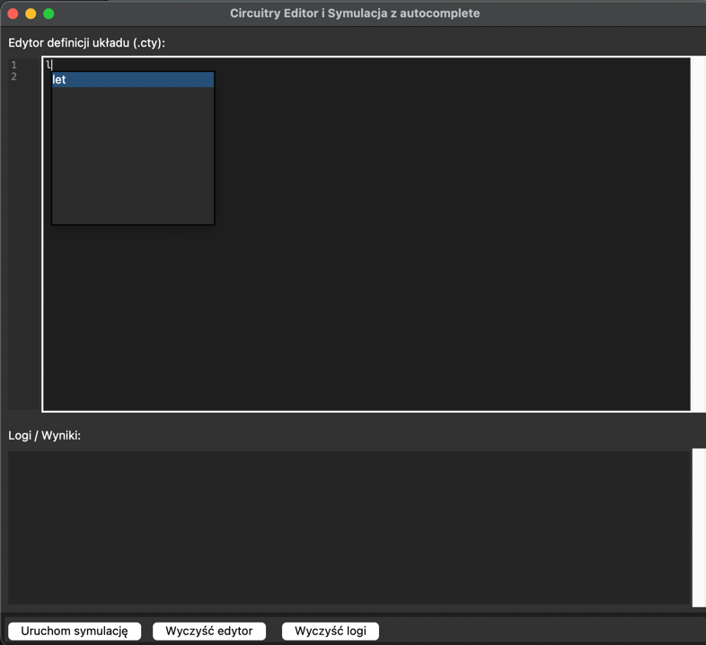
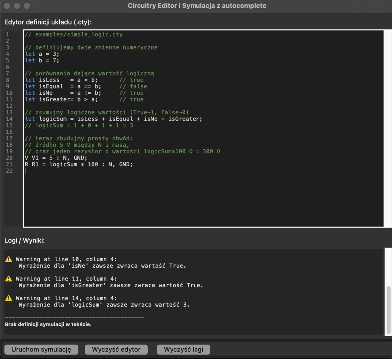
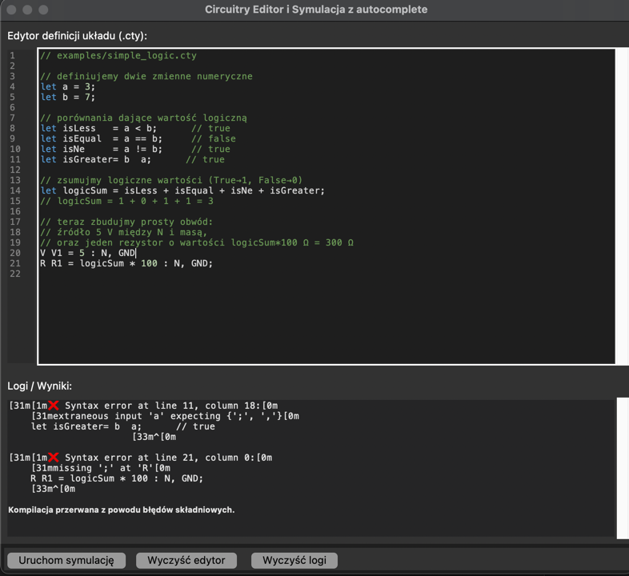

## 1. Temat projektu

interpreter języka opisu obwodów elektrycznych z analizą i interfejsem graficznym.

## Autorzy:

- Jakub Halfar - jakubhalfar@student.agh.edu.pl
- Aleksander Pyrdek - apyrdek@student.agh.edu.pl
- Antoni Pater - antonipater@student.agh.edu.pl

### Ogólne cele

- Umożliwić użytkownikowi zapis obwodu w prostym pliku tekstowym.
- Nie wymaga kompilacji – wszystkie obliczenia odbywają się w pamięci podczas uruchomienia.

---
**Rodzaj translatora**

- **Interpreter**: opis jest od razu parsowany (ANTLR4 → AST → `Circuit`), budowany jest model obwodu, uruchamiana jest
  symulacja i generowane są pliki wynikowe.

**Planowany wynik działania programu**

- **Wejście**: plik tekstowy ([`examples/`](./examples/)).

```
let includeR1 = true;
let includeR2 = false;

if (includeR1) {
    print("Wstawiam R1");
    R R1 = 100 : N, GND;
} else {
    print("Wstawiam R1_pom");
    R R1_pom = 1000 : N, GND;
}

if (includeR2) {
    print("Wstawiam R2");
    R R2 = 200 : N, GND;
} else {
    print("Nie wstawiam R2, wstawiam R3");
    R R3 = 300 : N, GND;
}

let useSeries = false;
if (includeR1) {
    if (useSeries) {
        print("Wstawiam szeregowo R4 i R5");
        R R4 = 400 : N, GND;
        R R5 = 500 : N, GND;
    } else {
        print("Wstawiam tylko R6");
        R R6 = 600 : N, GND;
    }
}

V V1 = 10 : N, GND;

dc();
```

- **Wyjście**:

```
Wstawiam R1

Nie wstawiam R2, wstawiam R3

Wstawiam tylko R6

=== Symulacja DC ===
Ground: GND = 0 V
Node voltages:
  N: 10.000000 V

Voltage source currents:
  V1: I_A  A

Element voltages i prądy:
  R1: Voltage = 10.000000 V, Current = 0.100000 A
  R3: Voltage = 10.000000 V, Current = 0.033333 A
  R6: Voltage = 10.000000 V, Current = 0.016667 A

```

### Planowany język implementacji

- Python ≥ 3.10

### Sposób realizacji skanera/parsera

1. **ANTLR 4** generuje:
    - Leksykalizator → [`grammar/CircuitryLexer.g4`](./grammar/CircuitryLexer.g4)
    - Parser → [`grammar/CircuitryParser.g4`](./grammar/CircuitryParser.g4)
    - Gramatyka rysowania → [`grammar/Draw.g4`](./grammar/Drawing.g4)
2. Skrypty budujące parser:

## Opis tokenów

Poniżej pełna lista tokenów zdefiniowanych w pliku [grammar/CircuitryLexer.g4](./grammar/CircuitryLexer.g4). Kolejność
jest ważna – słowa kluczowe muszą występować przed bardziej ogólnymi regułami (np. `ID`) dla poprawnego rozpoznawania.

| Token (ANTLR)        | Literal / Pattern                                             | Opis                                             |
|----------------------|---------------------------------------------------------------|--------------------------------------------------|
| **Brackets**         |                                                               |                                                  |
| `LPAREN`             | `'('`                                                         | Nawias otwierający                               |
| `RPAREN`             | `')'`                                                         | Nawias zamykający                                |
| `LBRACE`             | `'{'`                                                         | Klamra otwierająca                               |
| `RBRACE`             | `'}'`                                                         | Klamra zamykająca                                |
| `LBRACKET`           | `'['`                                                         | Nawias kwadratowy otwierający                    |
| `RBRACKET`           | `']'`                                                         | Nawias kwadratowy zamykający                     |
| **Math operators**   |                                                               |                                                  |
| `PLUS`               | `'+'`                                                         | Dodawanie                                        |
| `MINUS`              | `'-'`                                                         | Odejmowanie                                      |
| `MULTIPLY`           | `'*'`                                                         | Mnożenie                                         |
| `DIVIDE`             | `'/'`                                                         | Dzielenie                                        |
| `MODULO`             | `'%'`                                                         | Reszta z dzielenia                               |
| `EXPONENT`           | `'^'`                                                         | Operator potęgowania                             |
| **Component & node** |                                                               |                                                  |
| `DOT`                | `'.'`                                                         | Kropka (np. `R1.out`)                            |
| `RARROW`             | `'->'`                                                        | Mapowanie węzłów (np. `A->B`)                    |
| **Relational ops**   |                                                               |                                                  |
| `EQUAL`              | `'=='`                                                        | Równość                                          |
| `NOT_EQUAL`          | `'!='`                                                        | Nierówność                                       |
| `LESS`               | `'<'`                                                         | Mniejszy                                         |
| `GREATER`            | `'>'`                                                         | Większy                                          |
| `LESS_EQUAL`         | `'<='`                                                        | Mniejszy lub równy                               |
| `GREATER_EQUAL`      | `'>='`                                                        | Większy lub równy                                |
| **Assignment ops**   |                                                               |                                                  |
| `ASSIGN`             | `'='`                                                         | Przypisanie                                      |
| `ADD_ASSIGN`         | `'+='`                                                        | Dodaj i przypisz                                 |
| `SUB_ASSIGN`         | `'-='`                                                        | Odejmij i przypisz                               |
| `MUL_ASSIGN`         | `'*='`                                                        | Pomnóż i przypisz                                |
| `DIV_ASSIGN`         | `'/='`                                                        | Podziel i przypisz                               |
| `MOD_ASSIGN`         | `'%='`                                                        | Reszta i przypisz                                |
| `EXP_ASSIGN`         | `'^='`                                                        | Potęgowanie i przypisz                           |
| `INC`                | `'++'`                                                        | Zwiększenie o 1                                  |
| `DEC`                | `'--'`                                                        | Zmniejszenie o 1                                 |
| **Logical ops**      |                                                               |                                                  |
| `AND`                | `'&&'`                                                        | Logiczne i                                       |
| `OR`                 | `'                                                            |                                                  |'`                                                                                                                           | Logiczne lub                                          |
| `NOT`                | `'!'`                                                         | Negacja                                          |
| **Delimiters**       |                                                               |                                                  |
| `SEMICOLON`          | `';'`                                                         | Koniec instrukcji                                |
| `COLON`              | `':'`                                                         | Separator listy węzłów / typów                   |
| `COMMA`              | `','`                                                         | Separator elementów                              |
| **Keywords**         |                                                               |                                                  |
| `ALIAS`              | `'alias'`                                                     | Definicja aliasu węzła                           |
| `LET`                | `'let'`                                                       | Przypisanie zmiennej                             |
| `FN`                 | `'fn'`                                                        | Definicja funkcji                                |
| `RETURN`             | `'return'`                                                    | Zwracanie wartości                               |
| `SERIES`             | `'series'`                                                    | Blok szeregowy                                   |
| `PARALLEL`           | `'parallel'`                                                  | Blok równoległy                                  |
| `REVERSED`           | `'reversed'`                                                  | Odwrócenie podłączenia węzła                     |
| `SUBCIRCUIT`         | `'subcircuit'`                                                | Definicja podukładu                              |
| `IMPORT`             | `'import'`                                                    | Dyrektywa importu                                |
| `IF`                 | `'if'`                                                        | Warunek “if”                                     |
| `ELSE`               | `'else'`                                                      | Warunek “else”                                   |
| `FOR`                | `'for'`                                                       | Pętla “for”                                      |
| `WHILE`              | `'while'`                                                     | Pętla “while”                                    |
| `DO`                 | `'do'`                                                        | Pętla “do…while”                                 |
| `BREAK`              | `'break'`                                                     | Przerwanie pętli                                 |
| `CONTINUE`           | `'continue'`                                                  | Kontynuacja pętli                                |
| `SWITCH`             | `'switch'`                                                    | Instrukcja “switch”                              |
| `CASE`               | `'case'`                                                      | Filtr w “switch”                                 |
| `DEFAULT`            | `'default'`                                                   | Domyślny przypadek w “switch”                    |
| `TRUE`               | `'true'`                                                      | Wartość logiczna prawda                          |
| `FALSE`              | `'false'`                                                     | Wartość logiczna fałsz                           |
| **Simulation**       |                                                               |                                                  |
| `TRANSIENT`          | `'transient'`                                                 | Dyrektywa analizy transient                      |
| `AC`                 | `'ac'`                                                        | Dyrektywa analizy AC                             |
| `DC`                 | `'dc'`                                                        | Dyrektywa analizy DC                             |
| `MEASURE`            | `'measure'`                                                   | Dyrektywa pomiaru                                |
| **Drawing**          |                                                               |                                                  |
| `POS`                | `'pos'`                                                       | Definicja współrzędnych w dyrektywie `draw`      |
| **Literals & IDs**   |                                                               |                                                  |
| `FLOAT_LITERAL`      | `[+-]?([0-9]+(\.[0-9]+)?([eE][+-]?[0-9]+)?)([fpnuμmkKMGTP]?)` | Liczby zmiennoprzecinkowe z opcjonalną jednostką |
| `STRING_LITERAL`     | `'"' (~["\\]                                                  | '\\' .)*? '"'`                                   | Ciąg znaków w cudzysłowie                             |
| `ID`                 | `[a-zA-Z_][a-zA-Z0-9_]*`                                      | Nazwy komponentów, węzłów, funkcji, zmiennych    |
| **Comments & WS**    |                                                               |                                                  |
| `LINE_COMMENT`       | `'//' ~[\r\n]* -> skip`                                       | Komentarz jednolinijkowy (pomijany)              |
| `MULTILINE_COMMENT`  | `'/*' .*? '*/' -> skip`                                       | Komentarz wielolinijkowy (pomijany)              |
| `WS`                 | `[ \t\r\n]+ -> skip`                                          | Białe znaki (pomijane)                           |

## Gramatyka formatu

1. **Notation**  
   Gramatyka DSL opisu obwodów jest zdefiniowana w notacji ANTLR4.

2. **Grammar Definition**  
   Pełna definicja gramatyki znajduje się w pliku:  
   [`grammar/CircuitryParser.g4`](./grammar/CircuitryParser.g4)

---

## Jak uruchomić GUI z edytorem

Poniższe instrukcje dodają interaktywny edytor DSL w tkinter z:

- Syntax highlighting
- Numeracją linii
- Motywem Dark/Light
- Autocomplete (Ctrl+Space)
- Uruchamianiem analizy/symulacji

### Uruchomienie GUI

1. Otwórz terminal w katalogu projektu.
2. Uruchom

```bash
python circuitry.py
```

3. Pojawi się okno z edytorem DSL
   

### Edytor

- Wklej lub wpisz kod DSL .cty w polu tekstowym.
  
- Syntax highlighting (automatycznie przy wpisywaniu/wklejaniu):
    - Komentarze (//..., /*...*/) w kolorze komentarza.
    - Stringi w kolorze stringów.
    - Słowa kluczowe DSL:
      `alias`, `let`, `fn`, `return`, `if`, `else`, `for`, `while`,`switch`, `case`, `default`, `true`, `false`,
      `transient`,` ac`, `dc`, `measure`, `pos`, itd.
    - Literały liczbowe w dedykowanym kolorze.
    - Operatory wyróżnione.
- Numeracja linii: gutter po lewej, zsynchronizowany z przewijaniem.
- Motyw: w menu Theme wybierz Dark lub Light, zmienia tło i kolory.

### Inteligentne podpowiadanie:

- Fokus w edytorze.
- Naciśnij `Ctrl+Space`:
    - Wyświetla popup z propozycjami.
    - Propozycje:
        - Słowa kluczowe z gramatyki DSL.
        - Symbole zdefiniowane w edytorze: zmienne (let), aliasy, nazwy komponentów, funkcje, subcircuity — zbierane
          dynamicznie przez visitor.
          Wybierz strzałkami i Enter lub kliknij myszką, by wstawić.
          Prefix przed kursorem zostaje zastąpiony.
      ### Tak to działa:
      

---

## Obsługa błędów i walicacji

W tej sekcji opisujemy, jak zaawansowanie wykrywamy i obsługujemy błędy składniowe oraz semantyczne w DSL oraz jak
prezentujemy je użytkownikowi w GUI.

### Błędy składniowe

1. Wykrywanie: podczas parsowania ANTLR-em korzystamy z własnego listenera, który zbiera informacje o błędach składni.
   Jeśli parser napotka nieoczekiwany token lub brakujący element, listener rejestruje numer linii, kolumny i komunikat.
2. Prezentacja: po zakończeniu parsowania sprawdzamy, czy wystąpiły błędy składniowe. Jeśli tak, natychmiast wyświetlamy
   w polu logów komunikaty zawierające numer linii i kolumny oraz opis problemu, a dalsza analiza zostaje przerwana.
3. Podświetlanie: linie z błędami podświetlamy w edytorze dedykowanym tagiem, aby użytkownik od razu widział, w którym
   miejscu kod wymaga poprawy.
4. Informowanie użytkownika: GUI wyświetla alert lub ostrzeżenie, informując, że wystąpiły błędy składniowe i należy je
   poprawić przed dalszymi krokami.

### Błędy semantyczne

1. Wykrywanie: podczas wizyty AST w visitorze (CircuitBuilderVisitor) sprawdzamy poprawność użycia zmiennych, aliasów,
   wywołań funkcji itp. W przypadku niezadeklarowanej zmiennej, niezgodności argumentów funkcji lub innej niepoprawnej
   konstrukcji rejestrujemy błąd semantyczny z numerem linii i opisem.
2. Warningi: niektóre konstrukcje, choć poprawne, mogą być podejrzane lub nieskuteczne (np. przypisanie stałej, zawsze
   prawdziwy warunek). Takie sytuacje rejestrujemy jako warningi, aby użytkownik wiedział o potencjalnych nieoptymalnych
   fragmentach.
3. Podświetlanie: linie z warningami można wyróżnić innym stylem (np. subtelnym tłem), aby nieco oddzielić je od błędów
   krytycznych, ale nadal przyciągnąć uwagę użytkownika.

### Sugestie naprawy i podpowiedzi

- W komunikatach błędów składniowych można dodawać sugestie, np. “oczekiwano ‘;’ na końcu linii” lub “nieoczekiwany
  token, prawdopodobnie literówka”.
- Można wykorzystywać informacje z ANTLR o oczekiwanych tokenach, by lepiej formułować komunikat.
- Dla semantyki: przy nieznanej zmiennej zasugerować podobne nazwy, jeśli istnieją w scope.
- W GUI można wyświetlać tooltip nad podświetloną linią z sugestią bardziej szczegółową.

### Przykład warningów



### Przykład błędu



---

## Narzędzia i zależności

- **Język implementacji:** Python 3.10+
- **Generator skanerów/parserów:** ANTLR4 (4.x)
- **Build parsera:** `./scripts/build_parser.sh` (wywołuje ANTLR4 CLI)
- **Biblioteki Pythona:**
    - `antlr4-python3-runtime`
- **Inne narzędzia:**
    - `git`
    - dowolne IDE lub edytor tekstu (np. VSCode)  


